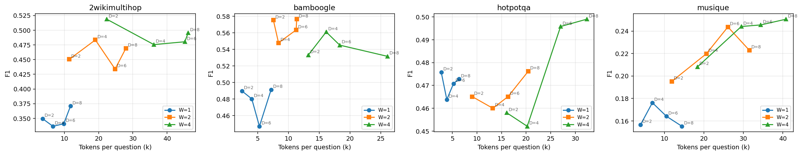
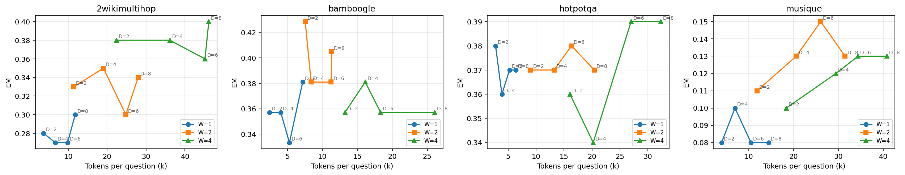

# SPARC-RAG repro — Qwen3-14B, dense-only wiki18

Reproduction of Yang et al. 2026 (arXiv:2602.00083) restricted to dense retrieval over the wiki18 corpus, single backbone (Qwen3-14B no-think), no DPO.

## Final results (1000q × 3 + 125q bamboogle)

Best (W,D) per dataset selected from a 100q grid sweep over W ∈ {1,2,4} and D ∈ {2,4,6,8} (top-k=6 dense, T=0.5/0.0, max_tokens=600, seed=42, Dmax=8). Run on 3 × RTX A6000 vLLM Qwen3-14B replicas.

| dataset | W,D chosen | n | EM | F1 | Acc | avg tokens | avg rounds | paper Qwen2.5-7B no-DPO (EM/F1/Acc) |
|---------|-----------|-----|------|------|------|------------|-----------|--------------------------------------|
| hotpotqa | W=4 D=8 | 1000 | 0.427 | 0.543 | 0.494 | 32806 | 2.03 | 0.454/0.559/0.484 |
| 2wikimultihop | W=4 D=2 | 1000 | 0.362 | 0.450 | 0.488 | 20831 | 1.53 | 0.452/0.562/0.562 |
| musique | W=4 D=8 | 1000 | 0.127 | 0.245 | 0.164 | 47286 | 2.67 | 0.162/0.243/0.178 |
| bamboogle | W=2 D=8 | 125 | 0.400 | 0.538 | 0.456 | 15525 | 1.92 | 0.360/0.427/0.368 |

Notes: paper numbers are SPARC-RAG (no DPO) on Qwen2.5-7B-Instruct, paper's hybrid retriever, IRCoT-style 500q test subsets. Our setup uses Qwen3-14B no-think + single dense E5-base retriever over the wiki18 corpus on 1000q subsets (Bamboogle 125q official). Absolute numbers therefore differ from paper but the scaling pattern is reproduced.

## 100q grid (full 4×3=12 configs per dataset)

### hotpotqa — F1

| W\D | D=2 | D=4 | D=6 | D=8 |
|------|------|------|------|------|
| W=1 | 0.476 | 0.464 | 0.471 | 0.473 |
| W=2 | 0.465 | 0.460 | 0.465 | 0.476 |
| W=4 | 0.458 | 0.452 | 0.496 | 0.499 |

### hotpotqa — avg tokens/q

| W\D | D=2 | D=4 | D=6 | D=8 |
|------|------|------|------|------|
| W=1 | 2735 | 3869 | 5232 | 6343 |
| W=2 | 9035 | 13223 | 16323 | 20435 |
| W=4 | 16069 | 20221 | 27006 | 32328 |

### 2wikimultihop — F1

| W\D | D=2 | D=4 | D=6 | D=8 |
|------|------|------|------|------|
| W=1 | 0.349 | 0.337 | 0.341 | 0.371 |
| W=2 | 0.450 | 0.483 | 0.434 | 0.469 |
| W=4 | 0.519 | 0.475 | 0.480 | 0.495 |

### 2wikimultihop — avg tokens/q

| W\D | D=2 | D=4 | D=6 | D=8 |
|------|------|------|------|------|
| W=1 | 3651 | 6671 | 9830 | 11786 |
| W=2 | 11436 | 19048 | 24816 | 27958 |
| W=4 | 22371 | 36142 | 45176 | 46151 |

### musique — F1

| W\D | D=2 | D=4 | D=6 | D=8 |
|------|------|------|------|------|
| W=1 | 0.157 | 0.176 | 0.164 | 0.155 |
| W=2 | 0.195 | 0.220 | 0.244 | 0.223 |
| W=4 | 0.208 | 0.244 | 0.245 | 0.251 |

### musique — avg tokens/q

| W\D | D=2 | D=4 | D=6 | D=8 |
|------|------|------|------|------|
| W=1 | 3961 | 6955 | 10524 | 14438 |
| W=2 | 11863 | 20616 | 26073 | 31510 |
| W=4 | 18397 | 29467 | 34392 | 40799 |

### bamboogle — F1

| W\D | D=2 | D=4 | D=6 | D=8 |
|------|------|------|------|------|
| W=1 | 0.490 | 0.480 | 0.447 | 0.491 |
| W=2 | 0.575 | 0.548 | 0.563 | 0.576 |
| W=4 | 0.533 | 0.561 | 0.545 | 0.532 |

### bamboogle — avg tokens/q

| W\D | D=2 | D=4 | D=6 | D=8 |
|------|------|------|------|------|
| W=1 | 2434 | 4032 | 5274 | 7168 |
| W=2 | 7538 | 8376 | 11232 | 11328 |
| W=4 | 13214 | 16111 | 18312 | 26059 |

## Best (max F1) per dataset on grid

| dataset | W | D | F1 (100q) | EM (100q) | tokens | F1 (full set) | EM (full set) |
|---------|---|---|-----------|-----------|--------|---------------|---------------|
| hotpotqa | 4 | 8 | 0.499 | 0.390 | 32328 | 0.543 | 0.427 |
| 2wikimultihop | 4 | 2 | 0.519 | 0.380 | 22371 | 0.450 | 0.362 |
| musique | 4 | 8 | 0.251 | 0.130 | 40799 | 0.245 | 0.127 |
| bamboogle | 2 | 8 | 0.576 | 0.405 | 11328 | 0.538 | 0.400 |

## Scaling figures

Each panel: F1 (or EM) vs avg tokens/q on the 100q grid. Series = W ∈ {1,2,4}, points = D ∈ {2,4,6,8}.

## Caveats

- Bamboogle grid uses 42q (one node408 shard). Bamboogle final eval is the full 125q.
- Paper's NQ + DPO + BM25 stages omitted by request.
- AnswerEvaluator prompt is a minimal STOP/CONTINUE faithful to Section 3.2 — paper appendix did not expose its verbatim prompt at fetch time.
- Per-config concurrency varied (4–20) due to vLLM saturation tuning during long runs.

