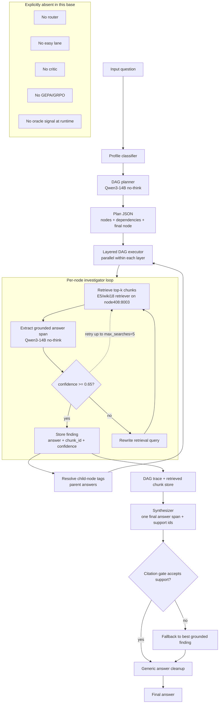

# Force-Hard No-Critic Architecture

This branch freezes the base method used for future experiments. It always runs the hard multi-agent DAG path and does not include a router, easy lane, critic, GEPA, GRPO, oracle labels, or W&B instrumentation.

